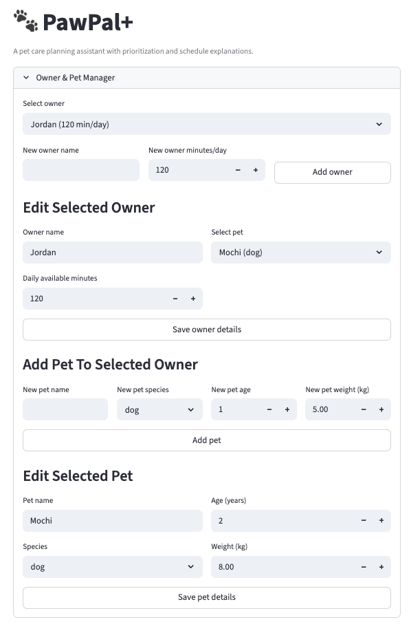
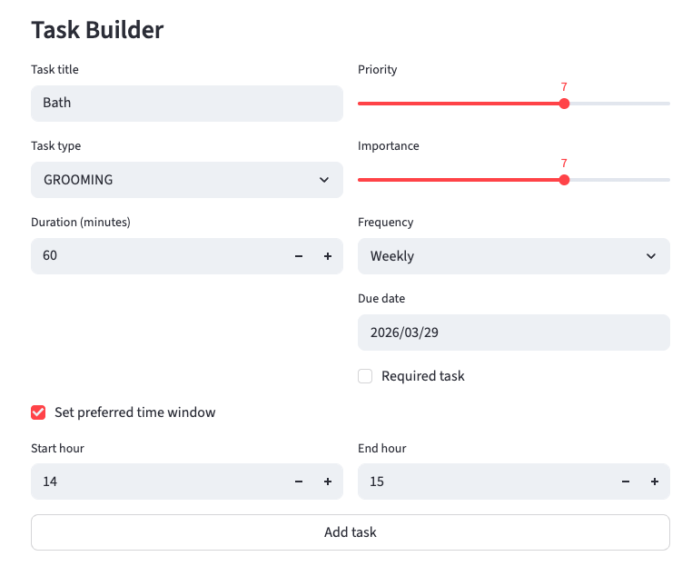
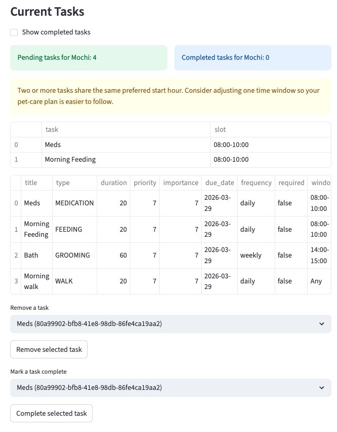
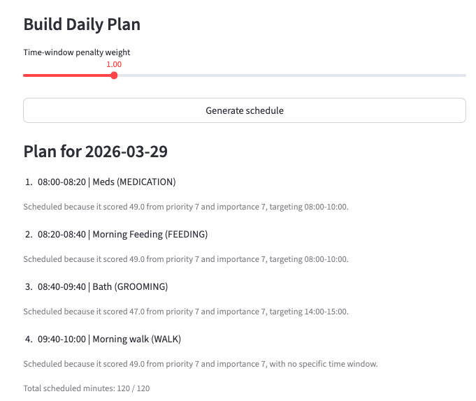

# PawPal+

PawPal+ is a Streamlit-based pet-care scheduling assistant for owners who need a clear, reliable daily plan.

It helps you:

- Manage owners, pets, and care tasks in one place
- Prioritize tasks using urgency-style scoring inputs (priority + importance)
- Generate a day plan that respects owner time limits
- Track completion and automate recurring tasks
- Detect preferred-time conflicts before they cause schedule confusion

## Feature Summary

### Owner and Pet Management

- Create and edit multiple owners
- Add and edit multiple pets per owner
- Track available care time per owner (minutes/day)

### Task Management

- Create tasks with title, type, duration, priority, and importance
- Mark tasks as required
- Add optional preferred time windows
- Set optional recurrence (`daily` or `weekly`) and due date
- Mark tasks complete from the UI

### Scheduling Behavior

- Tasks are sorted by preferred time window start hour
- Tasks without preferred windows are placed after timed tasks
- Schedule generation excludes already completed tasks
- Daily plans include short explanations for each scheduled item

### Conflict and Status Insights

- Preferred-time conflicts are flagged when multiple tasks share the same preferred start hour
- Pending and completed counts are shown for the selected pet
- Current task table supports hiding or showing completed tasks

### Recurrence Automation

- Completing a recurring task automatically creates the next pending occurrence
- Due date rollover rules:
- `daily` -> next due date is `completed_on + 1 day`
- `weekly` -> next due date is `completed_on + 7 days`

## Installation

### Prerequisites

- Python 3.10+ (recommended: use a virtual environment)

### Setup

```bash
python -m venv .venv
source .venv/bin/activate  # Windows: .venv\Scripts\activate
pip install -r requirements.txt
```

## Run the App

```bash
python -m streamlit run app.py
```

Once running:

1. Select or create an owner
2. Add a pet
3. Add tasks with optional preferred windows and recurrence
4. Review conflict warnings in Current Tasks
5. Generate the daily schedule
6. Mark tasks complete as care is performed

## Testing PawPal+

Run the full test suite from the project root:

```bash
python -m pytest
```

### What the tests cover

- Sorting correctness by preferred time window
- Completion status transitions
- Filtering by status and pet name
- Recurring-task rollover for daily and weekly frequencies
- Conflict detection for duplicate preferred start times
- Edge-case behavior (empty task lists, deterministic tie-breaking)

Confidence Level: ★★★★☆ (4/5)

Rationale: core scheduling, recurrence, filtering, and conflict behaviors are covered by passing automated tests; additional end-to-end UI scenarios can further improve confidence.

## Agent Mode Workflow

Agent Mode was used as an implementation copilot across design, coding, and validation:

- Planning and decomposition:
- Broke feature requests into concrete model, scheduler, UI, and test updates.
- Identified which logic belonged in domain classes (`Task`, `Pet`, `Scheduler`) versus Streamlit UI.

- Implementation support:
- Added and refined sorting, filtering, recurrence, and conflict-detection methods in `pawpal_system.py`.
- Integrated those methods into `app.py` so UI behavior reflects scheduler logic.

- Test generation and debugging:
- Drafted and expanded `tests/test_pawpal.py` with happy-path and edge-case coverage.
- Used iterative test runs to resolve mismatches between expected behavior and implementation.

- Documentation alignment:
- Updated this README and project reflection notes to stay consistent with the final code behavior.

In practice, Agent Mode helped speed up iterations while keeping changes traceable through tests and documentation updates.

## Project Structure

- `app.py`: Streamlit UI and interactive workflow
- `pawpal_system.py`: Domain models and scheduler logic
- `tests/test_pawpal.py`: Automated unit tests for scheduler behavior
- `main.py`: CLI-style demonstration script

## Troubleshooting

- App not launching:
- Confirm environment is activated and dependencies are installed
- Port in use:
- Restart Streamlit or run with a different port
- Import errors during tests:
- Run tests from project root using `python -m pytest`

## Future Enhancements

- End-to-end UI test automation
- Multi-pet global scheduling optimization
- Owner-adjustable tie-break strategies
- Enhanced conflict resolution suggestions in UI


## DEMO







