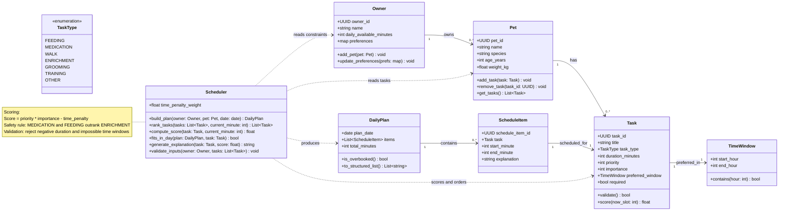

# PawPal+ Project Reflection

## 1. System Design

**a. Initial design**

- Briefly describe your initial UML design.

    - My initial UML design centered on `Owner`, `Pet`, `Task`, and `Scheduler` as the core classes. `Owner` and `Pet` capture profile and availability context, while each `Task` stores duration, priority, importance, and optional time-window constraints. The `Scheduler` ranks tasks using a weighted score and produces a `DailyPlan` made of `ScheduleItem`s, including brief explanations for why higher-priority care actions were scheduled first.

- What classes did you include, and what responsibilities did you assign to each?
    - I included these classes and responsibilities:

        **Owner**: Stores owner profile, daily time availability, and care preferences; serves as the top-level context for planning.

        **Pet**: Stores pet details and owns the list of care tasks that need scheduling.

        **Task**: Represents one care activity (feeding, meds, walk, etc.) with duration, priority, importance, and preferred time window.

        **TimeWindow**: Encapsulates allowed time ranges for a task and validates whether a slot is acceptable.
        
        **Scheduler**: Core planning engine; validates inputs, scores/ranks tasks, applies safety rules, and builds the daily schedule.

        **DailyPlan**: Holds the final day-level output (all scheduled items) and checks if the plan is overbooked.
        
        **ScheduleItem**: One scheduled task instance with start/end times plus a short explanation of why it was placed there.

        **TaskType** (enum): Standardizes task categories so safety/priority rules can be applied consistently.  

**b. Design changes**

- Did your design change during implementation?
- If yes, describe at least one change and why you made it.

---

## 2. Scheduling Logic and Tradeoffs

**a. Constraints and priorities**

- What constraints does your scheduler consider (for example: time, priority, preferences)?
- How did you decide which constraints mattered most?

**b. Tradeoffs**

- Describe one tradeoff your scheduler makes.
- Why is that tradeoff reasonable for this scenario?

---

## 3. AI Collaboration

**a. How you used AI**

- How did you use AI tools during this project (for example: design brainstorming, debugging, refactoring)?
- What kinds of prompts or questions were most helpful?

**b. Judgment and verification**

- Describe one moment where you did not accept an AI suggestion as-is.
- How did you evaluate or verify what the AI suggested?

---

## 4. Testing and Verification

**a. What you tested**

- What behaviors did you test?
- Why were these tests important?

**b. Confidence**

- How confident are you that your scheduler works correctly?
- What edge cases would you test next if you had more time?

---

## 5. Reflection

**a. What went well**

- What part of this project are you most satisfied with?

**b. What you would improve**

- If you had another iteration, what would you improve or redesign?

**c. Key takeaway**

- What is one important thing you learned about designing systems or working with AI on this project?
