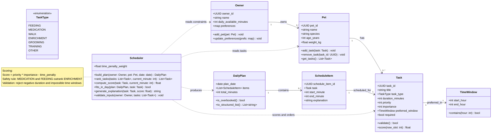

# PawPal+ Project Reflection

## 1. System Design

**a. Initial design**

- Briefly describe your initial UML design.

    - My initial UML design centered on `Owner`, `Pet`, `Task`, and `Scheduler` as the core classes. `Owner` and `Pet` capture profile and availability context, while each `Task` stores duration, priority, importance, and optional time-window constraints. The `Scheduler` ranks tasks using a weighted score and produces a `DailyPlan` made of `ScheduleItem`s, including brief explanations for why higher-priority care actions were scheduled first.

- What classes did you include, and what responsibilities did you assign to each?
    - I included these classes and responsibilities:

        **Owner**: Stores owner profile, daily time availability, and care preferences; serves as the top-level context for planning.

        **Pet**: Stores pet details and owns the list of care tasks that need scheduling.

        **Task**: Represents one care activity (feeding, meds, walk, etc.) with duration, priority, importance, and preferred time window.

        **TimeWindow**: Encapsulates allowed time ranges for a task and validates whether a slot is acceptable.
        
        **Scheduler**: Core planning engine; validates inputs, scores/ranks tasks, applies safety rules, and builds the daily schedule.

        **DailyPlan**: Holds the final day-level output (all scheduled items) and checks if the plan is overbooked.
        
        **ScheduleItem**: One scheduled task instance with start/end times plus a short explanation of why it was placed there.

        **TaskType** (enum): Standardizes task categories so safety/priority rules can be applied consistently.  

**b. Design changes**

- Did your design change during implementation?
- If yes, describe at least one change and why you made it.
  - Yes, my design evolved as I implemented the scheduler and encountered edge cases. For example, I added the `TimeWindow` class after realizing that some tasks had specific time constraints that needed to be validated separately from the main scheduling logic. This allowed for cleaner code and better separation of concerns, as the `Scheduler` could focus on ranking and placing tasks while the `TimeWindow` handled time-related validations.  
---

## 2. Scheduling Logic and Tradeoffs

**a. Constraints and priorities**

- What constraints does your scheduler consider (for example: time, priority, preferences)?
- How did you decide which constraints mattered most?

  - My scheduler considers the following constraints:

      - **Time availability**: The owner's total available minutes per day and the duration of each task.
      - **Task priority**: Each task has a priority level that indicates its importance relative to other tasks.
      - **Task importance**: A separate importance score that reflects how critical the task is for the pet's well-being.
      - **Preferred time windows**: Some tasks may have specific time frames during which they should ideally be performed (e.g., feeding in the morning).
      - **Safety rules**: Certain task types (like medication and feeding) must always be scheduled before less critical tasks (like enrichment).

    I decided that safety rules and time availability were the most critical constraints, as they directly impact the pet's health and the owner's ability to complete the care tasks. Priority and importance help guide the scheduling of tasks within those constraints, while preferred time windows add an additional layer of realism without being absolute requirements.

**b. Tradeoffs**

- Describe one tradeoff your scheduler makes.
- Why is that tradeoff reasonable for this scenario?

  - One tradeoff my scheduler makes is that it may not always schedule all tasks if the total required time exceeds the owner's available minutes. In such cases, it prioritizes tasks based on their combined priority and importance scores, potentially leaving out lower-priority tasks.

    This tradeoff is reasonable because it reflects real-world constraints: an owner can only do so much in a day, and it's better to ensure that the most critical care tasks are completed rather than trying to fit everything in and risking burnout or incomplete care. By focusing on the most important tasks, the scheduler helps ensure that the pet's essential needs are met even when time is limited.

---

## 3. AI Collaboration

**a. How you used AI**

- How did you use AI tools during this project (for example: design brainstorming, debugging, refactoring)?

  - I used AI tools primarily for design brainstorming and debugging. During the initial design phase, I prompted the AI to help me think through the necessary classes and their responsibilities, which helped me create a more comprehensive UML diagram. As I implemented the scheduler, I also used AI to help debug issues with task ranking and scheduling logic, especially when I encountered edge cases that I hadn't initially considered. The AI provided suggestions for how to handle these cases and offered explanations for why certain approaches might work better than others.
- What kinds of prompts or questions were most helpful?
  - Prompts that asked for specific design patterns or best practices in scheduling algorithms were particularly helpful. For example, asking the AI to suggest ways to handle task prioritization and time constraints led to insights about using weighted scoring and safety rules. Additionally, prompts that focused on debugging specific issues (e.g., "Why might my scheduler be overbooking tasks?") helped me identify logical errors and refine my implementation.

**b. Judgment and verification**

- Describe one moment where you did not accept an AI suggestion as-is.
  - There was a moment when the AI suggested a very complex scoring formula that included multiple factors and weights for ranking tasks. While the suggestion was technically sound, I felt that it might be too complicated for the scope of this project and could make the scheduler harder to understand and maintain. Instead, I opted for a simpler scoring approach that still captured the essential priorities and constraints without overcomplicating the logic.

- How did you evaluate or verify what the AI suggested?
  - I evaluated the AI's suggestions by considering their practicality and alignment with the project goals. For the complex scoring formula, I weighed the benefits of a more nuanced ranking system against the potential downsides of increased complexity. I also considered how easy it would be for other developers (or myself in the future) to understand and maintain the code. Ultimately, I decided that a simpler approach would be more effective for this project, even if it meant sacrificing some granularity in task ranking.

---

## 4. Testing and Verification

**a. What you tested**

- What behaviors did you test?
- Why were these tests important?

  - I tested task status transitions, including marking a task complete and verifying it changes from pending to completed (test_pawpal.py).
  - I tested pet task management by confirming that adding a task increases a pet’s task count (test_pawpal.py).
  - I tested time-based ordering using preferred time windows to ensure tasks are scheduled in a consistent chronological order (test_pawpal.py).
  - I tested filtering behavior:
    - Filter by status plus pet name (test_pawpal.py).
    - Case-insensitive status filtering (test_pawpal.py).
  - I tested recurring task automation:
    - Daily recurrence creates a new pending task due the next day after completion (test_pawpal.py).
    - Weekly recurrence creates a new pending task due in 7 days through scheduler completion flow (test_pawpal.py).

  - These tests verify core correctness of the planner: tasks are created and tracked properly, ordered by time as expected, and filtered reliably for owner views.
  - They protect critical care workflows by ensuring completion state changes are correct and recurring tasks are automatically regenerated with accurate due dates.
  - They reduce regression risk as features evolve, especially around scheduling logic, filtering behavior, and recurrence rules that directly affect day-to-day pet care reliability.

**b. Confidence**

- How confident are you that your scheduler works correctly?  
  - I’m reasonably confident that the scheduler works correctly for the core workflows implemented so far. I have automated tests covering status transitions, preferred-window-based sorting, task filtering by status and pet, and recurring-task rollover for daily and weekly frequencies. These tests give me good confidence that the most important behaviors are stable and that changes are less likely to break core functionality.  
  - At the same time, I would describe confidence as moderate rather than complete, because the current suite is still focused on unit-level behavior and does not yet cover every scheduling edge case end-to-end in the UI.

- What edge cases would you test next if you had more time?  
  - Tasks with invalid or borderline time inputs (for example: 00:00, 23:59, malformed values) to ensure validation is robust.
  - Recurring tasks around calendar boundaries (end of month, leap year dates, and weekly rollover across months).
  - Completion behavior when multiple recurring tasks are completed in sequence on the same day.
  - Tie-breaking when tasks have identical priority, importance, and time values.
  - Very low owner availability (for example: 5-15 minutes) to confirm overbooking handling and prioritization still behave correctly.
  - Cases where all tasks are completed and where no tasks exist, to verify UI messaging and filtering behavior.
  - Multi-pet scenarios with overlapping high-priority tasks to ensure filtering and schedule generation remain predictable.
  - End-to-end UI tests for task creation, completion, recurrence generation, and visibility of updated due dates after reruns.

---

## 5. Reflection

**a. What went well**

- What part of this project are you most satisfied with?
- I’m most satisfied with implementing recurring task automation and making it visible in the UI. Completing a daily or weekly task now creates the next pending task with the correct due date, and the behavior is backed by tests, which made the app both practical and reliable.
**b. What you would improve**

- If you had another iteration, what would you improve or redesign?
  - I would improve the task scheduling logic to better handle edge cases around time constraints and overbooking. For example, I would implement a more sophisticated tie-breaking mechanism for tasks with identical priority and importance, and I would enhance the scheduler to provide more informative feedback when it cannot fit all tasks within the owner's available time. Additionally, I would consider adding a feature to allow owners to manually adjust the schedule or mark certain tasks as non-negotiable, which could help in situations where the automated scheduling doesn't perfectly align with the owner's preferences or real-world constraints.

**c. Key takeaway**

- What is one important thing you learned about designing systems or working with AI on this project?
  - One important thing I learned is the value of comprehensive testing, especially for complex scheduling logic. Automated tests helped ensure that the scheduler behaves correctly under various scenarios and edge cases, which is crucial for maintaining reliability in a real-world application. 
  - Additionally, I learned that while AI can provide valuable insights and suggestions, it's essential to critically evaluate those suggestions and consider their practicality and alignment with project goals. Not every technically sound suggestion is the best fit for the specific context of the project, and human judgment is crucial in making those decisions.